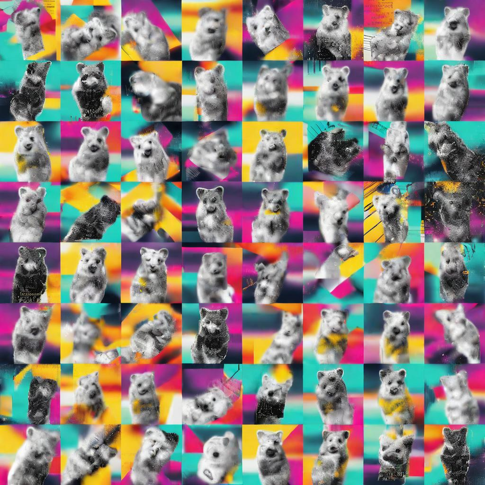

# ElieDDD.github.io

<figure><dataset>Detecion Mask</figcaption></figure>
   
'Datasets such as ImageNet are built on an array of practices of mediation of photography: collecting, labelling, composing, assembling images and distributing them.'
'In visual datasets, photographs are considered as self-standing documents free from the contexts from which they originated and through which they travelled.'
'The work of manually cross-referencing and labelling the photos is what makes datasets like ImageNet so unique[3]. In fact, there has been rarely in the history so many people paid to look at images and report what they see in them (Krishna et al, 2016). 

The automation of vision has not reduced but increased the number of eyeballs looking at images, of hands typing descriptions, of taggers and annotators. Yet what has changed is the context in which the activity of seeing is taking place, how retinas are entangled in heavily technical environments and how vision is driven by an extraordinary speed.'
'To organise the labelled images they collected, computer scientists rely on often pre-existing classification systems. ImageNet for example makes use of WordNet, a baroque construct containing 117.000 categories of words, whose stated aim is to provide an extensive lexical coverage of the English language. '
'Pressing into service an existing classification system however brings in its own share of problems, omissions and decision-making issues. WordNet for instance unreflexively integrates and naturalises racial and gender binaries and its structure contributes to reifying social norms.'
'These tensions are the object of an increasing awareness within the computer vision community, and as a recent post on the ImageNet website testifies, research efforts are undertaken to 'mitigate' these concerns constructively. However, it remains that computer science has an epistemic monopoly on the visual training of machines.'
https://unthinking.photography/articles/an-introduction-to-image-datasets
   
<figure><dataset>data augmentation</figcaption></figure>
   
///////////////////////////////////////////////////////////
   
<b>Image Data sets</b>
 <b>CIFAR 100
  ImageNest
  VisualQA 'VQA is a new dataset containing open-ended questions about images. These questions require an understanding of vision, language and commonsense knowledge to answer.
265,016 images (COCO and abstract scenes)'
MNIST - hand written digitas
MNIST -fashion
  
 </b>
<b>Architectures</b>

 
VGG Network architecture
 
ResNet

SqueezeNet

Xception

Acgan
/////
Specific processes such as Kullback-Liebler Divergence loss function, so called Earth Mover loss from the analogy of figuring out how much dirt needs to be moved to transform the shape of the UK to the shape of the US.
 <B>Backbones in models</B>
 'the term backbone refers to the feature-extracting network that processes input data into a certain feature representation. These feature extraction networks usually perform well as stand-alone networks on simpler tasks, and therefore, we can utilize them as a feature-extracting part in the more complicated models.

There are many popular CNN architectures that we can use as a backbone in neural networks. Some of them include:

VGGs – includes VGG-16 and VGG-19 convolutional networks with 16 and 19 layers. They proved effective in many tasks and especially in image classification and object detection.
ResNets – or Residual neural networks consist of skip connections or recurrent units between blocks of convolutional and pooling layers. Some popular versions of ResNet-50 and ResNet 101 are common for object detection and semantic segmentation tasks.
Inception v1 – GoogleNet is one of the most used convolutional neural networks as a backbone for many computer science applications, including video summarization and action recognition.'

 ///
>Exploring Transformers, Embedding and other key aspects of Generative AI
>Computer Vision: image classification, object detection, and segmentation,  'Multimodal' zero-shot image classification. CNNs learning directly from images, pooling.
>See: https://huggingface.co/docs/transformers.js/en/index
'We find that use of model-generated content in training causes
 irreversible defects in the resulting models, where tails of the original content distribution disappear.
 We refer to this effect as model collapse as well as MODE COLLAPSE and show that it can occur in Variational Autoencoders,
 Gaussian Mixture Models and LLMs. We build theoretical intuition behind the phenomenon and
 portray its ubiquity amongst all learned generative models'
>Shumailov, I., Shumaylov, Z., Zhao, Y., Gal, Y., Papernot, N., & Anderson, R. (2023). The Curse of Recursion: Training on Generated Data Makes Models Forget. ArXiv, abs/2305.17493.
>
>CNNs 'You train a CNN to do image analysis tasks, including scene classification, object detection and segmentation, and image processing. In order to understand how CNNs work, we'll cover three key concepts: local receptive fields, shared weights and biases, and activation and pooling.' https://uk.mathworks.com/

<b>'Unnatural learning procesess' </b>
Ideas: 'Feeding ordered data to a model sequentially can lead to an unnatural, unbalanced learning process.' Nguyen

'Augmentation helps generate more unbiased data' - such as flipping and rotating synthetic images and more to prevent <b> overfit </b>, look at Data Augmentation, see:https://github.com/aleju/imgaug
Imapct of <B>optimizers</B> such as 'AdamW'
<B> INCEPTION </b> 
An Inception Module is an image model block that aims to approximate an optimal local sparse structure in a CNN. Put simply, it allows for us to use multiple types of filter size, instead of being restricted to a single filter size, in a single image block, which we then concatenate and pass onto the next layer.

102 Category Flower Dataset & many other image data sets:https://paperswithcode.com/datasets?mod=images
  
Below, 100 objects in a grid derived from a model trained on Laion's 'Aesthetically low scoring images', a 'lightweight model that predicts the rating (a sample of) people gave when they were asked “How much do you like this image on a scale from 1 to 10?”'.
<figure><dataset>Aesthetically low scoring images</figcaption></figure>
<b>More on Pooling:</B>
'A common CNN model architecture is to have a number of convolution and pooling layers stacked one after the other. 

Why to use Pooling Layers?
Pooling layers are used to reduce the dimensions of the feature maps. Thus, it reduces the number of parameters to learn and the amount of computation performed in the network.
The pooling layer summarises the features present in a region of the feature map generated by a convolution layer. So, further operations are performed on summarised features instead of precisely positioned features generated by the convolution layer. This makes the model more robust to variations in the position of the features in the input image. 
 
Types of Pooling Layers:
 
Max Pooling
Max pooling is a pooling operation that selects the maximum element from the region of the feature map covered by the filter. Thus, the output after max-pooling layer would be a feature map containing the most prominent features of the previous feature map. ' https://www.geeksforgeeks.org/cnn-introduction-to-pooling-layer/
'Often, as we process images, we want to gradually reduce the spatial resolution of our hidden representations, aggregating information so that the higher up we go in the network, the larger the receptive field (in the input) to which each hidden node is sensitive.

Often our ultimate task asks some global question about the image, e.g., does it contain a cat? So typically the units of our final layer should be sensitive to the entire input. By gradually aggregating information, yielding coarser and coarser maps, we accomplish this goal of ultimately learning a global representation, while keeping all of the advantages of convolutional layers at the intermediate layers of processing.' https://colab.research.google.com/github/d2l-ai/d2l-pytorch-colab-classic/blob/master/chapter_convolutional-neural-networks/pooling.ipynb

////////////////////////////////////

From : https://colab.research.google.com/drive/1n_xrgKDlGQcCF6O-eL3NOd_x4NSqAUjK#scrollTo=4y7CHnkwsKEy

'If this interested you and you want to learn more about AI art, here are some links!'

<B>How to Overfit Your Model</B>
https://becominghuman.ai/how-to-overfit-your-model-e1a84906a361
From Stack Exchange: 'Memorization
For absolute overfitting, you want a network that is technically capable to memorize all the examples, but fundamentally not capable of generalization. I seem to recall a story about someone training a predictor of student performance that got great results in the first year but was an absolute failure in the next year, which turned out to be caused by using all columns from a table as features, including the column with the sequential number of the student, and the system simply managed to learn that e.g. student #42 always gets good grades and student #43 has poor performance, which worked fine until next year when some other student was #42.

For an initial proof of concept on CIFAR, you could do the following:

Pick a subset of CIFAR samples for which the color of top left corner pixel happens to be different for every image, and use that subset as your training data.
Build a network where the first layer picks out only the RGB values of the top left corner and ignores everything else, followed by a comparably wide fully connected layer or two until the final classification layer.
Train your system - you should get 100% on training data, and near-random on test data.
After that, you can extend this to a horribly overfitting system for the full CIFAR:

As before, filter the incoming data so that it's possible to identify each individual item in training data (so a single pixel won't be enough) but so that it's definitely impossible to solve the actual problem from that data. Perhaps the first ten pixels in the top row would be sufficient; perhaps something from metadata - e.g. the picture ID, as in the student performance scenario.
Ensure that there's no regularization of any form, no convolutional structures that imply translational independence, just fully connected layer(s).
Train until 100% training accuracy and weep at the uselessness of the system.' https://stats.stackexchange.com/questions/474738/how-do-i-intentionally-design-an-overfitting-neural-network
See also: https://towardsdatascience.com/overfitting-vs-underfitting-a-complete-example-d05dd7e19765
/////////////////////
See super weird regularized 'photo_of_a_woman-enhanced'https://github.com/Luehrsen/sd_regularization_images/tree/main
Huuging Face on regularized images:https://huggingface.co/datasets/ProGamerGov/StableDiffusion-v1-5-Regularization-Images  has set of synthetic train images

////////////////////////////////////
////////////////////////////////////

'VQGAN stands for Vector Quantized Generative Adversarial Network, while CLIP stands for Contrastive Image-Language Pretraining. Whenever we say VQGAN-CLIP1, we refer to the interaction between these two networks. They’re separate models that work in tandem.

In essence, the way they work is that VQGAN generates the images, while CLIP judges how well an image matches our text prompt. This interaction guides our generator to produce more accurate images:'
https://ljvmiranda921.github.io/notebook/2021/08/08/clip-vqgan/
### Resources

* [Alien Dreams: An Emerging Art Scene](https://ml.berkeley.edu/blog/posts/clip-art/): first "mainstream" introduction to AI Art.
* [The Illustrated VQGAN](https://ljvmiranda921.github.io/notebook/2021/08/08/clip-vqgan/): The neural network generating images is VQGAN. This is a description of how it works! Fairly technical.
* https://tryolabs.com/blog/2022/10/25/the-guide-to-fine-tuning-stable-diffusion-with-your-own-images

### Notebooks

There's other notebooks you can try, too! Some of them use different styles, or give you different features to play with.

* [Create Realistic AI-Generated Images](https://colab.research.google.com/drive/1wkF67ThUz37T2_oPIuSwuO4e_-0vjaLs): Also designed for beginners, this one lets you pick a starting initial image to work from.

* [VQGAN+CLIP](https://colab.research.google.com/drive/1_4Jl0a7WIJeqy5LTjPJfZOwMZopG5C-W): The first notebook to use VQGAN, which is now the most popular AI generator to use. Mostly reimplemented as the herb flavors.
* [Semantic Style Transfer](https://colab.research.google.com/drive/17AqhaKLZmmUA27aNSc6fJYMR9uypeIci?usp=sharing): Can do "style transfers", where you make one image stylized like another image.
* [The Big Sleep](https://colab.research.google.com/drive/1NCceX2mbiKOSlAd_o7IU7nA9UskKN5WR). The very first CLIP-based notebook, starting the whole trend. Uses a different image generator and gives very different pictures.
* [CLIP-Guided Diffusion](https://colab.research.google.com/drive/12a_Wrfi2_gwwAuN3VvMTwVMz9TfqctNj): One of the newest innovations in CLIP tech. Uses a different image generator.
* [CLIPIT PixelDraw](https://colab.research.google.com/github/dribnet/clipit/blob/master/demos/PixelDrawer.ipynb): AI-generated pixel art!

### Communities

* [/r/deepdream](https://www.reddit.com/r/deepdream/): A subreddit where people post their AI art. Some really hardcore artists in here producing amazing stuff.
* [EleutherAI](https://www.eleuther.ai/): A "grassroots collective" of AI researchers. To my understanding there's a lot of AI artists in their discord, but I haven't checked this myself.

/////////////Notes

<b>What is Overfitting?</b>
When a model performs very well for training data but has poor performance with test data (new data), it is known as overfitting. In this case, the machine learning model learns the details and noise in the training data such that it negatively affects the performance of the model on test data. Overfitting can happen due to low bias and high variance.

Reasons for Overfitting:
Data used for training is not cleaned and contains noise (garbage values) in it
The model has a high variance
The size of the training dataset used is not enough
The model is too complex
Ways to Tackle Overfitting
Using K-fold cross-validation
Using Regularization techniques such as Lasso and Ridge
Training model with sufficient data
Adopting ensembling techniques

<B>What is Underfitting?</B>
When a model has not learned the patterns in the training data well and is unable to generalize well on the new data, it is known as underfitting. An underfit model has poor performance on the training data and will result in unreliable predictions. Underfitting occurs due to high bias and low variance.
https://www.simplilearn.com/tutorials/machine-learning-tutorial/overfitting-and-underfitting

<B>Cats V Dogs and Overfit</B>?
https://colab.research.google.com/github/google/eng-edu/blob/master/ml/pc/exercises/image_classification_part1.ipynb   Cats V Dogs classification
GenAI without models?
Subsumption Architectures
Situated Computing  water, sound
Fractals
Game of Life
Gas
////////////////////////////////////

Hu, G., Peng, X., Yang, Y., Hospedales, T. M. and Verbeek, J. (2016) Frankenstein: Learning Deep Face Representations using Small Data, CoRR, abs/1603.0. Available from: http://arxiv.org/abs/1603.06470 [Accessed 29 September 2017].

